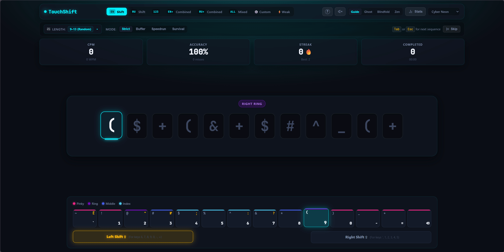

# TouchShift — Blindfold Number & Shift Layer Trainer

A fast, zero-friction web application designed to train blindfold touch-typing for top-row numbers and Shift layer characters in English (`!@#$%^&*()_+`) and Cyrillic/Russian (`!"№;%:?*()_+`).


## Features
- **Zero-Friction Engine**: Automatically advances on typing; when the sequence finishes, a new 4–8 character sequence appears in 0ms without any mouse clicks or delays.
- **English & Cyrillic Shift Layers**: Dedicated presets for `!@#$%^&*()_+` and `!"№;%:?*()_+`.
- **Blindfold Training Visualizer**: Interactive top-row visualizer with finger color zones (Pinky, Ring, Middle, Index) and dynamic Opposite-Hand Shift indicator (Left Shift vs Right Shift).
- **4 Visual Modes**: `Guide` (fully visible), `Ghost` (subtle hints), `Blindfold` (keyboard hidden for true muscle memory testing), and `Zen` (pure minimal focus showing only target keys in the center).
- **Procedural Web Audio**: Zero-latency synthesized mechanical key clicks, error tone, and sequence completion chords.
- **Weak-Key Heatmap**: Identifies which keys you miss most often and provides a one-click "Drill Weak Keys" mode.
- **Arbitrary & Fixed Sequence Lengths**: Dual min/max stepper controls allowing custom length ranges (default 4–8 random) or fixed lengths (`Min === Max`), dynamically capped to fit your screen.
- **Themes**: Cyber Neon, Matrix Green, Tokyo Night, Nord Frost, Snow White, and Solarized Light.

## Getting Started

```bash
# Install dependencies
npm install

# Start development server
npm run dev

# Run automated tests
npm test

# Build for production
npm run build
```
